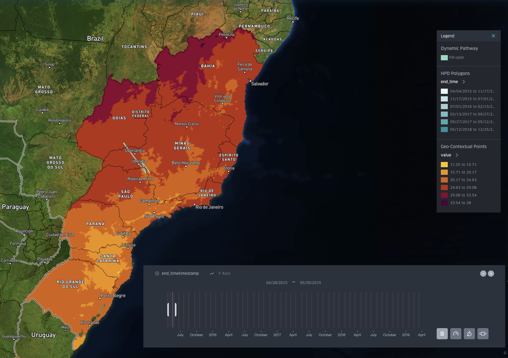
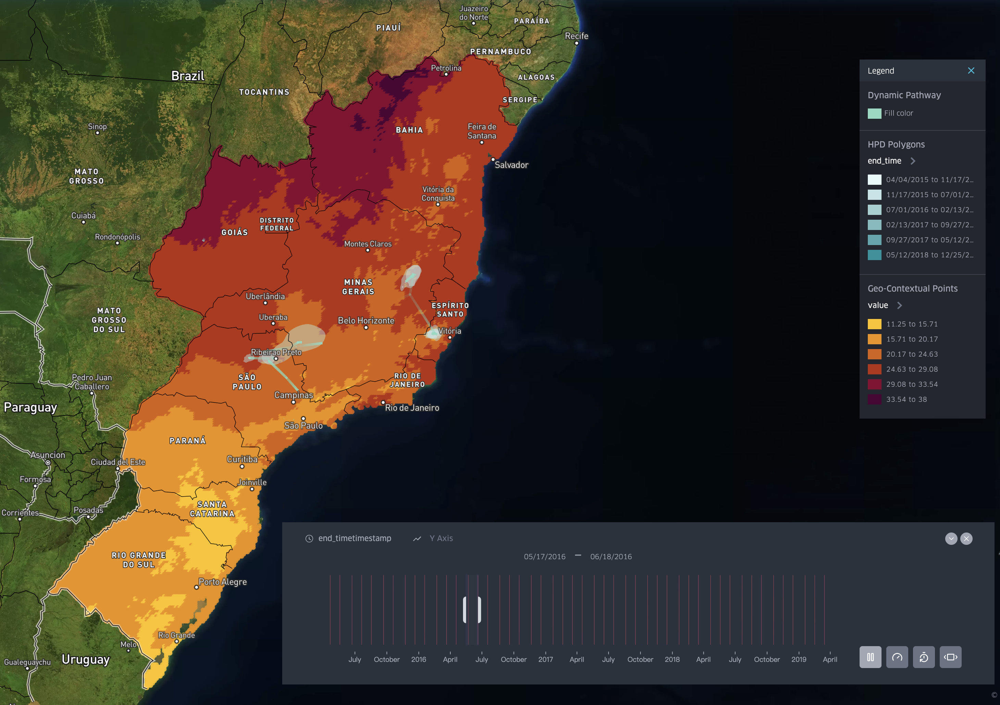
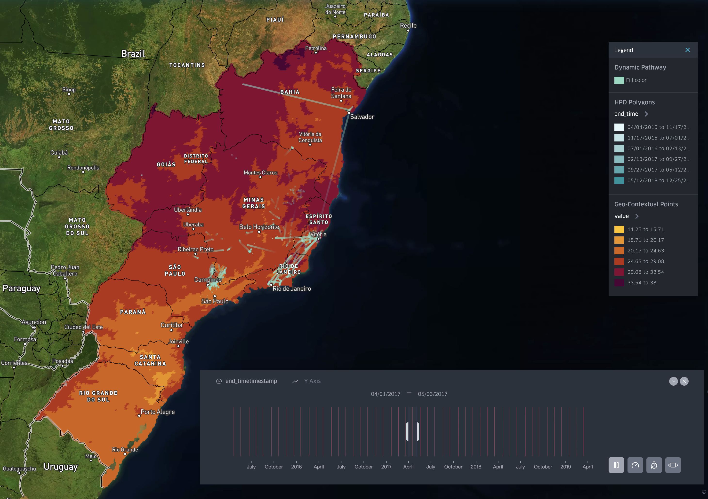
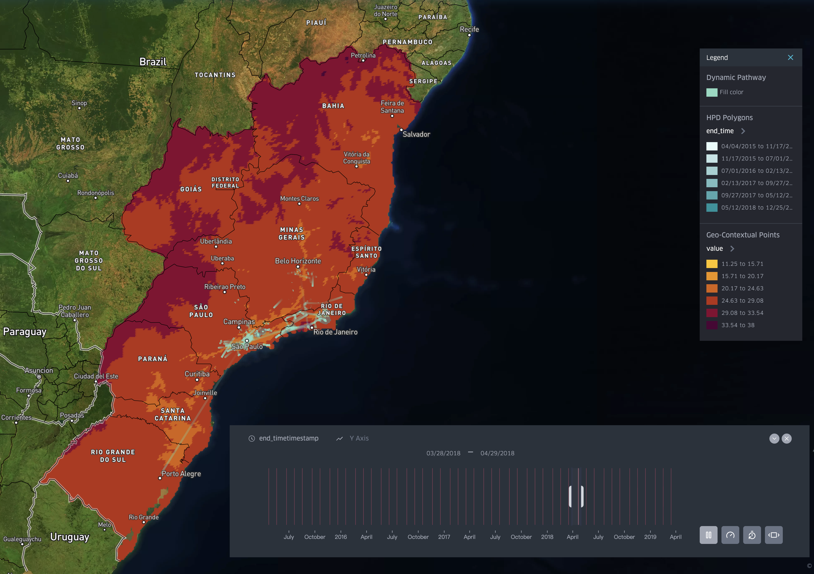

# spread.gl User Manual

**spread.gl v2.0-beta** is an integrated data pipeline designed to visualize pathogen dispersal over geographic space and time. It unifies complex backend data processing (the extraction, transformation, and loading [ETL] of phylogenetic trees and environmental rasters) with a highly interactive, GPU-accelerated web rendering engine into a single, user-friendly graphical interface.

---

## 🌟 Key Features of v2.0-beta

* **Universal File Support & Frictionless UX**: Offers a frictionless user experience through workspace-wide and global drag-and-drop upload functionality. The platform natively parses raw spatial files (`.geojson`, `.csv`) and instantly restores saved session states (`.json`), allowing users to transition seamlessly between dataset processing and visual exploration.
* **Tianditu (天地图) Official Basemaps**: Integrates China's official Tianditu basemaps natively into the mapping engine. This ensures strict geographic mapping compliance and seamless accessibility for researchers within Chinese academia.
* **Interactive Visual Analytics**: Supports real-time, exploratory analysis of phylogeographic structures. Users can dynamically filter transmission networks by Bayes Factor thresholds, play animations on a synchronized 4D spacetime timeline, and inspect raw geospatial data layers without dropping records.

---

## 🔒 Data Privacy & Live Demo

spread.gl is designed with a **privacy-first architecture**. 

Unlike conventional web visualization tools that upload your sequences to third-party cloud servers, spread.gl processes and renders all datasets locally. This relieves all security and compliance concerns regarding sensitive, unpublished molecular epidemiology sequences.

### 🌐 Live Hugging Face Demo
For instant evaluation without any local installation, users can immediately test the platform via our official Hugging Face Space. All processing remains isolated within your browser session:
👉 **[Hugging Face Space Live Demo]([Insert HF Link Here])**

### 📦 Local Running Options (Docker Hub)
For full privacy-sandbox isolation, you can pull the official, production-ready container images directly from Docker Hub and run them locally:

```bash
# Pull and run the backend processing toolkit
docker run -d -p 8000:8000 florentlee/spread.gl.processing.toolkit:v2.0-beta

# Pull and run the frontend web application
docker run -d -p 8080:80 florentlee/spread.gl.web.page:v2.0-beta
```

Alternatively, you can run a **Local Python/Node Dev Server** serving from the source code directly on your local network.

---

## 🗺️ The 3-Step Top Navigation GUI Architecture

The application is structured around a top navigation bar dividing the workflow into three sequential stages: **Setup**, **Workspace**, and **Map**.


### Step 1: Setup (Pipeline Configuration)
In this initial step, you load your raw phylogenetic trees, location mappings, and environmental data layers to run them through the processing bridge.

* **Analysis Type**: Choose **Discrete** (for discrete spatial traits modeled on fixed location points) or **Continuous** (for continuous latitude/longitude traits representing geographic coordinates).
* **Upload Files**:
  * **Tree File**: Upload your NEXUS format tree file (e.g., `.tree` or `.trees` file from BEAST).
  * **Location File** *(Discrete only)*: Upload a CSV containing location names and coordinates. The CSV must have a comma separator and a header of `location,latitude,longitude`.
  * **BEAST Log File** *(Optional - Discrete only)*: Upload the BEAST `.log` file containing rate indicators to compute Bayes factors for the migration network.
* **Metadata Traits**:
  * **Most Recent Tip Time**: Specify the calendar date (e.g., `2021-06-01`) or decimal year (e.g., `2021.42`) of the latest sampled taxon to calibrate the timeline.
  * **Location Trait**: Enter the name of the annotation trait representing geography (e.g., `region` or `coordinates`). If continuous and using separate lat/lon annotations, separate them with a comma (e.g., `location1,location2`).
* **Reprojection Options** *(Advanced)*: Convert coordinates on-the-fly from a local reference system (e.g., British National Grid EPSG:27700) to World Geodetic System 1984 (WGS84 EPSG:4326).
* **Trimming Options** *(Advanced)*: Exclude geographic outliers by referencing an external CSV file (e.g., checking for empty locations or null attributes).
* **Geo-Contextual Data Layers**:
  * **Regions**: Upload a CSV with environmental values and a GeoJSON boundary map to color state/provincial polygons based on variables (e.g. swine density).
  * **Rasters**: Upload a set of monthly climate `.tif` rasters, a GeoJSON boundary mask, and a list of target locations to clip and plot environmental grids.

### Step 2: Workspace (Data Preview)
Once the processing completes, the application automatically routes you to the **Workspace** panel. This stage allows you to review the outputs before loading them onto the map.

* **Summary Metrics**: Check how many features, branches, and polygons were successfully parsed.
* **Download Outputs**: Download the clean spatial outputs directly to your computer:
  * `dynamic_pathway.geojson`: Dynamic trajectories (trips) tracking migrations over time. You can create point, line and arc layers based on this file.
  * `aggregated_migration_network.geojson` *(Discrete only)*: Aggregated Markov jumps between discrete locations with computed weights.
  * `geo_contextual_data.geojson / .csv`: Clipped rasters or populated region boundary maps.
* **Verification**: Verify that no coordinates are out of bounds or missing. Click the **Apply to Map** button to load the datasets into the Kepler engine.

### Step 3: Map (Visualization & Interaction)
The **Map** view launches the interactive, GPU-accelerated map engine.

* **Arc Layer (Migration Network)**: Displays arcs showing discrete dispersal patterns. Arcs are colored from source (greenish blue) to target (red).
* **Trip Layer (Pathways)**: Renders phylogenetic branches as moving light trails. You can adjust the trail length and thickness.
* **Kepler Timebar**: Displays a timeline at the bottom of the map. Play the animation to watch the virus disperse across the globe chronologically, or drag the time window handles to see specific intervals.
* **Geo-Contextual Layer**: Shows overlay grid points (raster data) or styled boundary polygons (regional data) matching the map backdrop.

---

## ⚡ Non-Technical Configuration Guides

### 1. Uploading Files
1. In **Step 1: Setup**, locate the upload inputs.
2. Drag and drop your NEXUS tree file into the **Tree File** dropzone.
3. If doing a discrete analysis, drop your coordinate reference list into the **Location CSV** dropzone.
4. Click **Run Pipeline** at the bottom of the panel and wait for the Workspace view to appear.

### 2. Configuring Geo-Contextual Data Layers
To overlay climate grid cells or demographic polygons onto your dispersal map:
* **For Regional Polygons (e.g., PEDV in China)**:
  1. Set **Environmental Type** to `Regions`.
  2. Upload your environmental spreadsheet (`Environmental_variables.csv`).
  3. Upload your map boundary file (`China_map.geojson`).
  4. Specify the **Location Column** inside the CSV (e.g., `location`) and the **Location Variable** property inside the GeoJSON (e.g., `name`).
* **For Raster Grids (e.g., Climate Rasters)**:
  1. Set **Environmental Type** to `Rasters`.
  2. Upload one or more `.tif` files.
  3. Upload the geographic mask boundaries (`geoBoundaries-BRA-ADM1.geojson`).
  4. Upload a text file listing the regions of interest (`Involved_brazilian_states.txt`).

### 3. Shifting the Bayes Factor Slider
In discrete phylogeographic studies, many migration routes are tested, but only a few are statistically significant. 
1. In the **Setup** tab, if you uploaded a BEAST log file, the **Bayes Factor threshold** slider will be active.
2. The default threshold is `3.0` (indicating positive support).
3. Slide the value **higher** (e.g., `10.0` for strong support, or `30.0` for very strong support) to filter out support paths.
4. The map will instantly update, hiding weaker routes and adjusting the width of the remaining arcs based on their **jump weights** (number of estimated transitions).

---

## 🛠️ Developer Setup & Deployment Guide

### Local Development
To run the decoupled backend and frontend locally:

1. **Activate Virtual Environment & Run Backend**:
   ```bash
   cd backend
   python -m venv .venv
   source .venv/bin/activate
   pip install -r requirements.txt
   pip install -e .
   uvicorn main:app --host 0.0.0.0 --port 8000
   ```

2. **Run Frontend**:
   ```bash
   cd frontend
   npm install --legacy-peer-deps
   npm start
   ```
   Open [http://localhost:8080](http://localhost:8080) in your browser.

### Cloud Deployment (Hugging Face Spaces)
The project is configured to run on Hugging Face Spaces using the Docker runtime under a split architecture:

* **Frontend Space**: Hosts the static web app compiled via Nginx.
  * Target Space: `florentlee/SpreadGLWebSite`
* **Backend Space**: Hosts the FastAPI server handling DendroPy computations.
  * Target Space: `florentlee/SpreadGLBackEnd`

*Both directories contain production-ready Dockerfiles configured to listen on port 7860 as required by Hugging Face.*

---

## 📖 Tutorials & Examples

This section walks through continuous and discrete spatial analysis use cases using the React GUI and backend processing toolkit.

### Example 1: Continuous Phylogeography (YFV in Brazil)

Continuous phylogeography traces the exact latitude and longitude of viral lineages over time. By syncing this trajectory with environmental variables (e.g., temperature grids), researchers can correlate climate variations with dispersal speed.

* **Dataset**: Yellow Fever Virus (YFV) in Brazil
  * **Tree File**: `inputdata/YFV_Brazil/YFV.MCC.tree`
  * **Rasters**: Directory of `.tif` rasters `inputdata/YFV_Brazil/wc2.1_5m_tmax_2015-2019/`
  * **Mask Boundary**: `inputdata/YFV_Brazil/geoBoundaries-BRA-ADM1.geojson`
  * **Location List**: `inputdata/YFV_Brazil/Involved_brazilian_states.txt`

#### 🚶 Step-by-Step Instructions:
1. Select the **Setup** tab and set **Analysis Type** to **Continuous**.
2. Upload `YFV.MCC.tree` in the **Tree File** field. Your tree file must strictly adhere to the standard `#NEXUS` format.
3. Enter `location1,location2` under **Location Trait** and set **Most Recent Tip Time** to `2019-04-16`.
4. Turn on the **Environmental Data Layer** and select **Rasters** as the type.
5. Upload the folder containing the `.tif` rasters, select `geoBoundaries-BRA-ADM1.geojson` as the mask boundary, and choose `Involved_brazilian_states.txt` as the location list. Set **Location Variable** to `shapeName`.
6. Click **Run Pipeline**. The backend maps the viral trajectories and clips the temperature rasters to the target states.
7. Click **Apply to Map**. The visualization engine natively binds the moving **Trip Layer** (which renders viral lineage trails set to 1/10th of the outbreak duration) and the shifting **Geo-Contextual Data Layer** (displaying temperature grid points) to the shared Kepler.gl **Timebar**.

A core feature of the Map tab is the synchronized 4D timeline. When you press play on the time slider, Kepler.gl perfectly synchronizes all spatial layers simultaneously: the viral lineages moving along the dynamic_pathway (Trips Layer), the shifting credible intervals of the hpd_polygons, and the fading dynamic environmental temperature rasters. This allows researchers to visually correlate pathogen spread directly with changing ecological conditions.

#### 📅 Outbreak Evolution:
| YFV Spread in 2015 | YFV Spread in 2016 |
| :---: | :---: |
|  |  |

| YFV Spread in 2017 | YFV Spread in 2018 |
| :---: | :---: |
|  |  |

---

### Example 2: Discrete Phylogeography & Bayes Factors (SARS-CoV-2 B.1.525)

Discrete phylogeography reconstructions represent viral spread as transitions among discrete locations. This example demonstrates how to run a discrete phylogeographic analysis with Bayes Factor filtering to resolve primary transmission hubs.

* **Dataset**: SARS-CoV-2 Eta Variant (B.1.525)
  * **Tree File**: `inputdata/SARS_CoV-2_B.1.525_Global/Analysis2.joint.phylogeo.HIPSTR.tree`
  * **Locations**: `inputdata/SARS_CoV-2_B.1.525_Global/full.dataset.2910.region.coordinates.csv`
  * **BEAST Log**: `inputdata/SARS_CoV-2_B.1.525_Global/Analysis2.thorney.joint.phylogeo.burnin.removed.log`

#### 🚶 Step-by-Step Instructions:
1. Select the **Setup** tab and set **Analysis Type** to **Discrete**.
2. Upload the B.1.525 `.tree` file.
3. Upload the `.csv` Location List (containing location, latitude, longitude) and type the corresponding **Location Trait** as `region`. Set **Most Recent Tip Time** to `2021-07-03`.
4. In the **Bayes Factors** section, upload the BEAST `.log` file and set the Burn-in fraction (e.g., `0.1` or 10%).
5. Click **Run Pipeline**.
6. Click **Apply to Map**. The map will load the animated `dynamic_pathway` by default.
7. Click the layer visibility icon to turn on the **Aggregated Migration Network**. Use the auto-generated Bayes Factor filter in the left panel to dynamically threshold the network (e.g., slide to `>150` for decisive evidence, isolating the primary export hubs).

#### 📊 Visualizations:
| B.1.525 Dispersal Path | B.1.525 Migration Flow |
| :---: | :---: |
|  |  |
